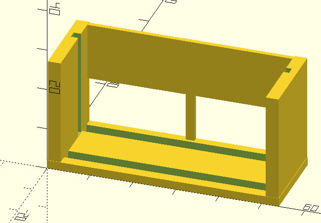

# Bracket for Grove Utrasonic Ranger

This bracket was created in 2021 for use with the Seeed 101020010 Ultrasonic Ranger.

The purpose is to hold the sensor board perpendicular to the bench.

* [Seeed 101020010 ](https://www.seeedstudio.com/Grove-Ultrasonic-Distance-Sensor.html)
* [digikey.ca 1597-1122-ND](https://www.digikey.ca/en/products/detail/seeed-technology-co-ltd/101020010/5482600)
* [mouser 713-101020010](https://www.mouser.ca/ProductDetail/Seeed-Studio/101020010?qs=1%252B9yuXKSi8D6aN06jq6dCQ%3D%3D)

